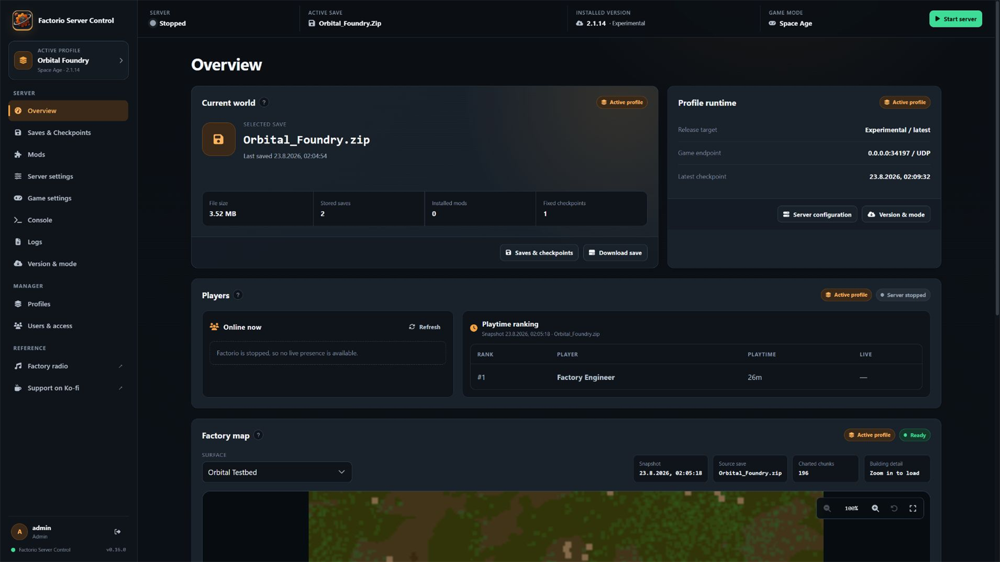
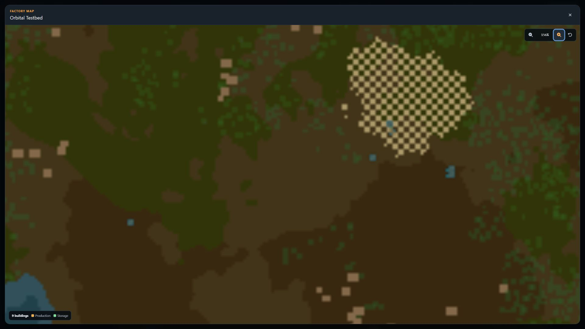
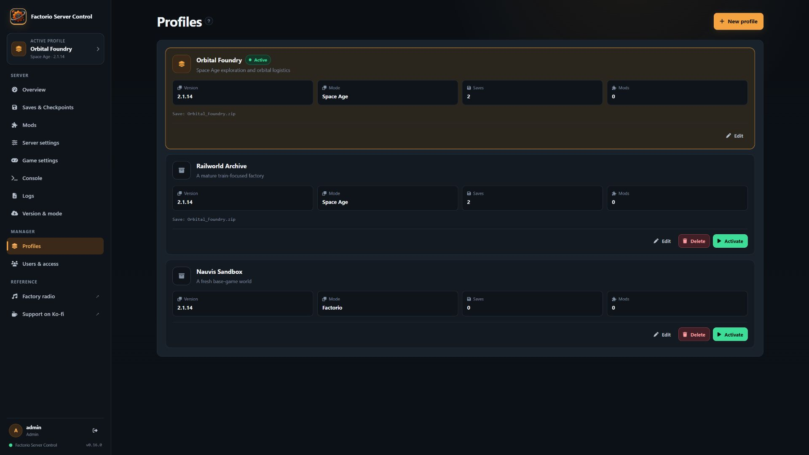
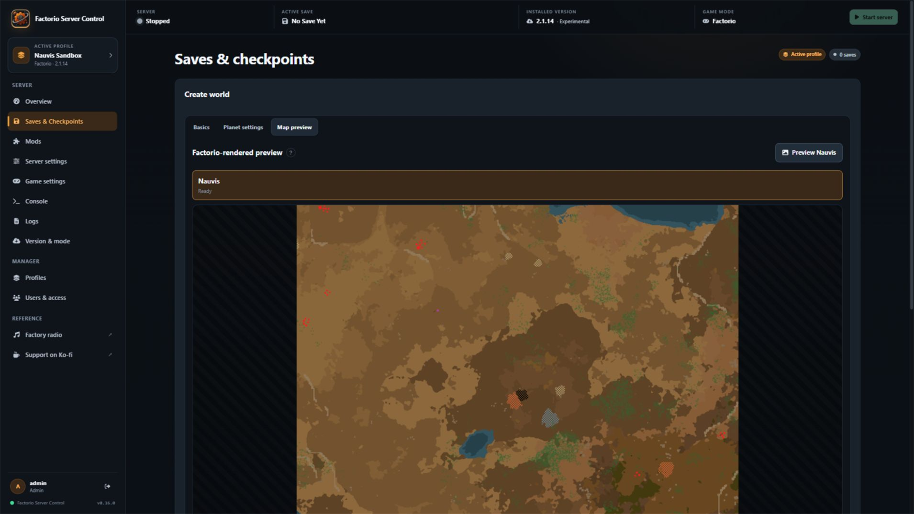
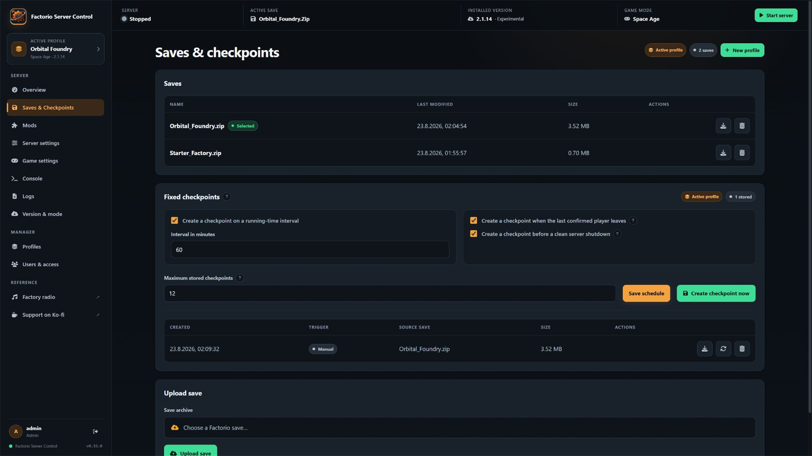
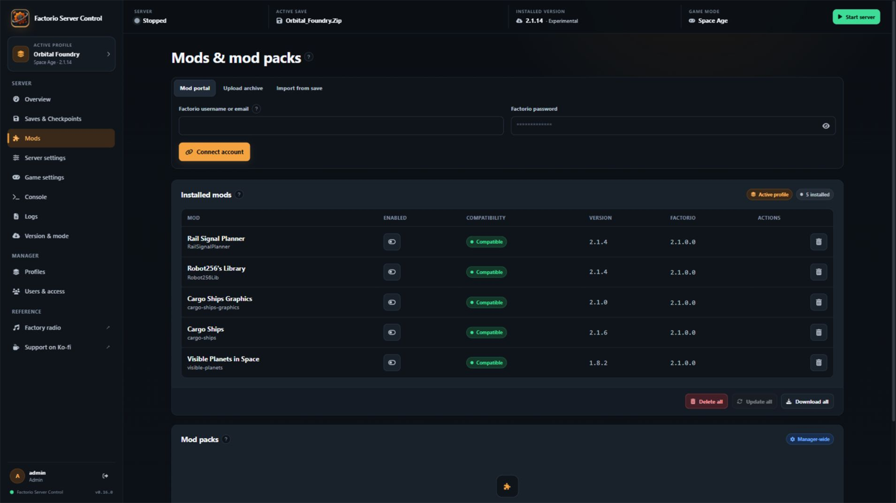
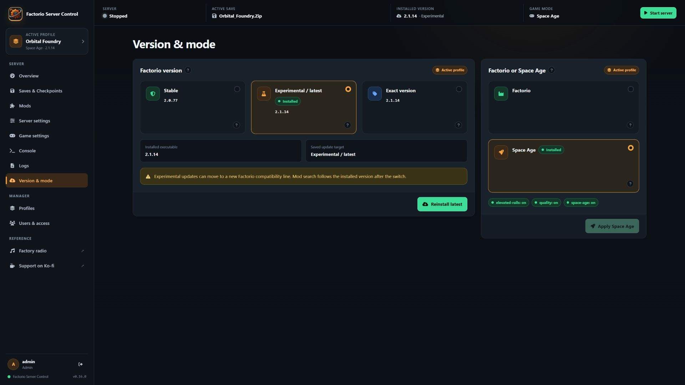

[](https://github.com/Tricade/factorio-server-manager/actions/workflows/test-workflow.yml)
[](https://github.com/Tricade/factorio-server-manager/releases/latest)
[](LICENSE)
[](https://ko-fi.com/tricade)

# Factorio Server Control

A self-hosted web interface for operating one Factorio dedicated server safely: profiles, saves, fixed checkpoints, mods, game versions, Space Age, world creation, logs, users and server controls in one responsive UI.

> [!NOTE]
> This repository is a modernized fork of the original **Factorio Server Manager** project, [OpenFactorioServerManager/factorio-server-manager](https://github.com/OpenFactorioServerManager/factorio-server-manager). The original project, its authors and its contributors remain the source of the manager this fork builds on. See [Origin and attribution](#origin-and-attribution).

## What this fork adds

### Safer server operations

- Event-driven status updates without disruptive full-page polling.
- Start, save-and-stop and force-stop controls available throughout the active-profile UI.
- Live connected-player state plus snapshot-derived playtime ranking with explicit offline and freshness states.
- Persistent internal autostart that restores the active profile after a container restart.
- Staged Factorio release replacement with validation and rollback while persistent game data stays mounted.
- Upload and path hardening, capped/redacted logs, local-only RCON and refusal to start with disposable manager or game-data paths.

### Independent server profiles

- Named profiles for switching one stopped Factorio runtime between different saves, mods, settings, game modes and exact Factorio versions.
- Automatic, idempotent migration of an existing installation into `Current setup`.
- Profile cloning, clean-profile creation, rename, activation and deletion.
- Transactional profile switching with staging, validation and rollback; switching never starts Factorio implicitly.

### Saves, worlds and checkpoints

- Upload, download, select and delete profile-scoped saves.
- A first-world wizard that uses Factorio itself to validate settings and render previews.
- Base Factorio and Space Age world generation with a shared seed, presets and per-planet controls.
- Fixed checkpoints outside Factorio's rotating autosaves, created manually, on a schedule, when the final player leaves or before a clean shutdown.
- Verified retention and non-destructive checkpoint restore into a new playable save.

### Factory-map snapshots

- Authenticated PNG snapshots generated from an isolated copy of the selected save and enabled mods.
- Nauvis, planets, space platforms and modded surfaces listed separately.
- Player-visible platform names and framing around persistent player construction instead of all explored terrain.
- Direct wheel/button zoom, drag-to-pan, reset-to-fit and a separate fullscreen lightbox.
- A lazy Canvas building-footprint layer and legend at detailed zoom levels, with graceful fallback for legacy snapshots.
- Manual generation or a manager-wide scheduled refresh interval.
- No exporter mod is added to the playable profile, and the running game process, original save, active mod list and achievement state are not modified.

### Versions, modes and mods

- Official Stable, Experimental/latest and exact Factorio archive selection while the server is stopped.
- Exact installed-version and selected-target persistence across container recreation.
- Explicit base Factorio/Space Age switching, including persistent built-in feature-mod state.
- Mod Portal search filtered to the active Factorio compatibility line.
- Recursive required-dependency resolution plus opt-in optional/recommended dependencies.
- Reusable mod packs and import from an existing save.

### Modern interface and deployment

- Responsive **Foundry Night** UI for desktop and mobile.
- Persistent active-profile context, exact UI version/revision and cache-busted frontend assets.
- Docker and Docker Compose builds produced directly from this repository.
- `linux/amd64` production image matching the official Factorio headless server platform.
- Split-path Unraid support without an overlapping `/opt/factorio` mount.
- Linux and Windows backend/frontend CI plus a production-container persistence test.

The implementation details and deliberate boundaries are documented in [TECHNICAL-NOTES.md](TECHNICAL-NOTES.md). User-visible changes are recorded in [CHANGELOG.md](CHANGELOG.md).

## Screenshots

### Operational overview



### Factory map viewer



### Independent profiles



### New world



### Saves and fixed checkpoints



### Compatible mods and dependencies



### Factorio version and Space Age mode



## Runtime model

One manager process deliberately controls one Factorio process and one active profile. Profiles are independent stored setups, not simultaneous game servers.

To run several Factorio servers at once, run several manager containers. Every container needs unique host TCP/UDP ports and completely separate manager and game-data mounts. Never point two live containers at the same `/opt/fsm-data` or `/opt/factorio` data.

## Quick start with a published image

1. Copy `docker/.env.registry.example` to `docker/.env.registry`.
2. Set `FSM_IMAGE` to a published image such as `ghcr.io/tricade/factorio-server-manager:latest` or an immutable SemVer tag.
3. Choose the first-install `FACTORIO_VERSION`: `latest`, `stable` or an exact three-part release. Leave `RCON_PASS` empty to generate and persist a random localhost-only value, or supply your own long random value.
4. Start the container:

```sh
docker compose --env-file docker/.env.registry -f docker/docker-compose.registry.yaml pull
docker compose --env-file docker/.env.registry -f docker/docker-compose.registry.yaml up -d
```

The GHCR package is public and does not require a registry login for pulls. No registry credential belongs in this repository.

The example publishes:

| Purpose | Container port | Default host port |
| --- | ---: | ---: |
| Manager UI | `80/tcp` | `8080/tcp` |
| Factorio game server | `34197/udp` | `34197/udp` |

The manager serves HTTP inside the container. The direct registry example sets `FSM_COOKIE_SECURE=false` so login works over a private HTTP connection. Put the UI behind a trusted TLS reverse proxy before exposing it beyond a trusted LAN or VPN, and set `FSM_COOKIE_SECURE=true` whenever users always enter through HTTPS. The fuller `docker/docker-compose.yaml` example does both through Traefik and requires a real domain and email address in an ignored local `.env` file.

## Privacy and outbound connections

Factorio Server Control has no built-in analytics or telemetry. Manager accounts, configuration, logs, saves and map snapshots remain in the documented persistent mounts and are not sent to the fork maintainer. Release discovery and installation contact Factorio's official HTTPS services; mod search, authentication and downloads contact the official Factorio Mod Portal only when those features are used. When connecting a Factorio account, its password is submitted to `auth.factorio.com` over HTTPS but is not retained; the returned username/user key is stored with restrictive permissions in `/opt/fsm-data/factorio.auth`. Optional Factory Radio and Ko-fi links open their respective third-party sites only when selected in the browser. Review those services' own privacy terms before using them.

## Required persistent storage

The production entrypoint refuses to start when manager credentials or game data would disappear during a container replacement.

| Container path | Purpose |
| --- | --- |
| `/opt/fsm-data` | Manager database, users, credentials, profiles, checkpoints, map snapshots, release state and autostart preference |
| `/opt/factorio` | Complete Factorio installation and game data when using one combined mount |
| `/opt/factorio/saves` | Saves when using the supported split-mount layout |
| `/opt/factorio/mods` | Downloaded and built-in mod state when using the split layout |
| `/opt/factorio/config` | Factorio server and map configuration when using the split layout |

Use either one complete `/opt/factorio` mount or all three split game-data mounts. Do not configure both layouts at once. A combined mount retains the installed program tree. With split mounts, `/opt/fsm-data/runtime-state.json` retains the exact installed version and selected target; after a container recreation the entrypoint downloads that same official version again instead of silently advancing a rolling channel. Split-mount recreations therefore require access to Factorio's official download service.

## Compatibility with the original manager

The public product name changed, but the compatibility-sensitive folder structure and technical namespace deliberately remain compatible with the original manager. The repository/image slug, executable name and default Unraid root `/mnt/user/appdata/factorio-server-manager/` are unchanged. The upstream Go module path, `FSM_*` environment names, `/opt/fsm-data`, `/opt/factorio` and existing database/config filenames also remain stable. This lets a stopped original Factorio Server Manager deployment be migrated without renaming its stored data solely for branding.

Compatibility does not make live storage shareable. Stop the original container, take a backup and give the replacement exclusive access to the copied manager data and either the complete Factorio mount or all three supported split mounts. Legacy anonymous Docker volumes must be located and copied manually; the new persistence guard will not accept missing mappings. Keep the original data until login, users, profiles, saves, mods, settings and the selected Factorio version have been verified. See [Docker and Unraid migration](docker/README.md#migrate-a-legacy-installation) for the read-only discovery steps.

## First login

On a fresh persistent manager-data volume, the manager creates a one-time administrator credential file named `initial-admin-password.txt` with restrictive permissions. Sign in, change the administrator password, and the bootstrap file is removed. Container recreation keeps the existing database and does not generate a different password when `/opt/fsm-data` is mounted correctly.

## Main workflows

### Profiles

The first profile-capable start copies an existing unprofiled setup into `Current setup`. Creating or activating another profile requires Factorio to be fully stopped. Activation snapshots the current setup, stages and validates the target, restores its exact game version and leaves the game stopped until **Start** is pressed.

### New worlds

The world generator appears only while the active profile has no save. Once a save exists, the page becomes the normal save/checkpoint library. Create a fresh profile when another independently configured world is needed.

### Factory maps

The manager renders chart pixels through the installed Factorio headless binary in a disposable workspace. Factorio 2.0.61 or newer is required. Completed images live below persistent `/opt/fsm-data/map-snapshots/<profile-id>` and are served only by authenticated routes.

### Fixed checkpoints

When the game is running, checkpoint creation asks Factorio over local RCON to write a complete save first. Archives are validated before retention can remove an older checkpoint. Restoring is allowed only while Factorio is stopped and creates a new normal save without changing the source checkpoint.

### Container and game-server autostart

Docker's restart policy controls the manager container. On SIGTERM, the manager stops accepting HTTP work, requests a clean Factorio shutdown and allows up to 165 seconds inside the configured 180-second container grace period. The manager-wide **Autostart** preference controls whether the active profile's Factorio process starts after manager initialization. Disable it when a deliberately stopped game server must remain stopped across container restarts.

## Unraid

The submission-ready Community Applications metadata lives in [ca_profile.xml](ca_profile.xml), and the canonical Docker template is [templates/factorio-server-manager.xml](templates/factorio-server-manager.xml). Once the listing is approved, search for **Factorio Server Control** in the Unraid Apps tab.

For a manual installation before approval, download the [raw template](https://raw.githubusercontent.com/Tricade/factorio-server-manager/main/templates/factorio-server-manager.xml) to:

```text
/boot/config/plugins/dockerMan/templates-user/my-factorio-server-manager.xml
```

Then select **Factorio Server Control** under **Docker → Add Container → User templates**. Fork and maintainer attribution remains in the listing overview, project and support links instead of the visible product name. Every default host path lives below one appdata root:

```text
/mnt/user/appdata/factorio-server-manager/
├── data/
├── saves/
├── mods/
└── config/
```

The public app name does not rename this technical appdata root. Its four container targets remain separate, and the template does not add a second overlapping `/opt/factorio` path. More migration and deployment detail is available in [docker/README.md](docker/README.md).

## Build from source

Requirements:

- Node.js matching the CI setup
- Go matching `src/go.mod`
- Docker with Buildx for the production image

Build the frontend and backend release bundles:

```sh
npm ci
npm test
npm run build
cd src
go version
go test ./... -short -count=1
go vet ./...
go run golang.org/x/vuln/cmd/govulncheck@v1.7.0 ./...
```

On Windows, `scripts/build-release.ps1` creates the release bundle. On Linux, use `make build` or `make gen_release` for the cross-platform archives. The maintained release checklist and user-facing GitHub notes template live in [RELEASE.md](RELEASE.md).

Build a local production container without publishing it:

```powershell
.\scripts\publish-image.ps1 -Image factorio-server-manager -Tag local
```

Publishing is deliberately opt-in through `-Push`. The local helper may push non-release tags such as `edge`; it refuses `latest` and SemVer pushes because the GitHub release workflow owns those aliases. Releases use matching SemVer Git tags, npm versions and immutable container tags; `latest` is a moving alias built from the same release commit.

## Contributing

This fork releases from `main`. The historical upstream `develop` branch has a different history and is not the base for work here.

1. Update `main`: `git switch main && git pull --ff-only origin main`.
2. Create a focused `feature/...` or `fix/...` branch.
3. Keep each change coherent and test it locally.
4. Update `CHANGELOG.md`, documentation and screenshots when behavior changes.
5. Open a pull request against `main` and merge only after CI passes.

## Origin and attribution

Factorio Server Control is based on the original **Factorio Server Manager** project, [OpenFactorioServerManager/factorio-server-manager](https://github.com/OpenFactorioServerManager/factorio-server-manager), created by Mitch Roote and developed with contributions from knoxfighter, Jannaahs and the wider upstream contributor community. Its upstream origin and copyright notices are preserved, and the project continues under the MIT License.

This fork is independently maintained and is not affiliated with or endorsed by Wube Software. Factorio is a trademark of Wube Software.

## Support

If this fork saves you time, you can support continued work through [ko-fi.com/tricade](https://ko-fi.com/tricade).

## License

Licensed under the [MIT License](LICENSE).
