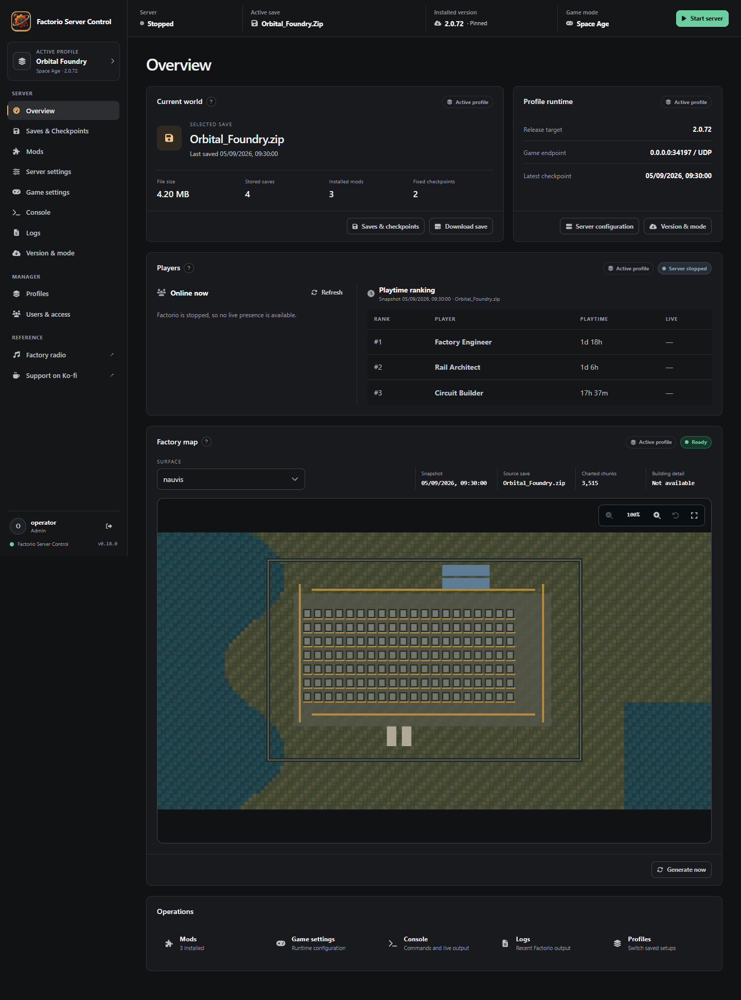
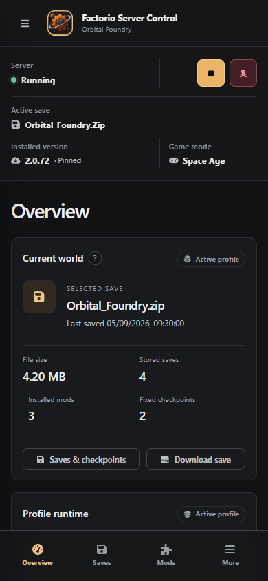
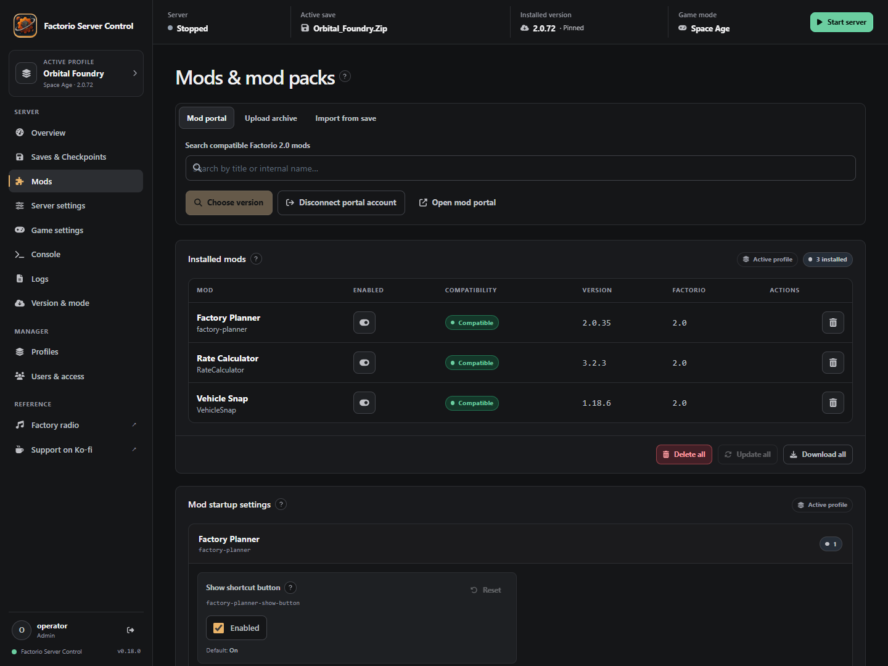
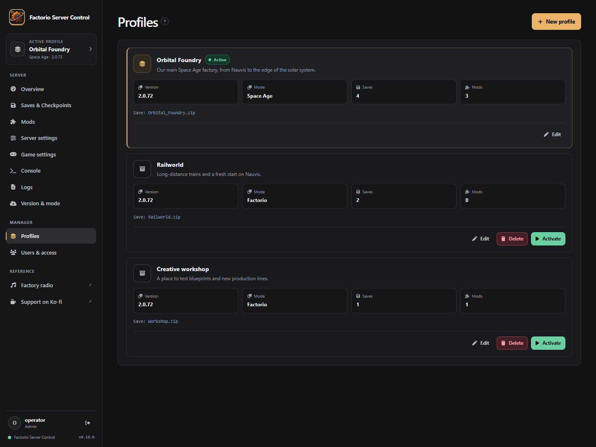

# Web interface redesign draft

This draft builds on version 0.18.0 and refines the existing Foundry Night interface. It is intended for visual review before a release.

## Design direction

- Neutral graphite backgrounds and shallow surface contrast replace the blue cast and decorative gradients.
- Warm amber highlights the selected navigation icon and primary actions. Profile-scope badges use a quieter neutral treatment; manager scope remains distinct.
- A narrower sidebar gives content more room while preserving navigation labels, profile identity and exact installed version.
- The overview uses a smaller save icon, compact metrics and aligned action footers. Players and map metadata use separators instead of nested cards.
- Existing fields, tables, dialogs and login use the same shared palette. Mobile layouts retain readable status text, touch targets and keyboard focus indicators.

## Preview

These previews use synthetic local fixture data, not a connected Factorio server. They demonstrate the actual React interface and production stylesheet. The draft does not add a demo mode to the deployed application.

### Desktop overview



### Mobile overview



### Mod management



### Profiles



## Scope and review

The existing shared API client, profile context, routes and administrator/viewer boundary remain in use. Process lifecycle, profile switching, persistence, map generation and backend APIs retain their existing behavior. No production dependencies, external fonts, telemetry, deployment options or data migrations are introduced.

Review the density, graphite/amber balance and readability on a typical server-management session before promoting the draft. Screenshots in the main README remain the released UI for comparison.

One existing mobile issue remains a review item: the long Mods page heading's hidden help tooltip can extend the document width on narrow screens. The tooltip positioning is outside this visual draft; the mod tables themselves scroll within their containers.

## Browser regression check

The standalone check serves the built application on an ephemeral loopback port with synthetic read-only API fixtures. It verifies hidden-navigation focus behavior and Escape handling at 1024, 1050 and 1099 pixels, desktop navigation at 1100 pixels, and named process controls with 40-pixel touch targets at 390 pixels. It rejects outbound browser requests and never connects to a real Factorio server.

After the standard `npm ci`, `npm test` and `npm run build` checks, run from the repository root:

```sh
npm install --prefix build/ui-browser-check --no-save --package-lock=false playwright@1.63.0
node build/ui-browser-check/node_modules/playwright/cli.js install chromium
node scripts/verify-ui-layout.cjs build/ui-browser-check/node_modules/playwright
```

On Windows, use `npm.cmd` if PowerShell blocks the npm script shim. To use an existing Chromium installation, set `BROWSER_EXECUTABLE_PATH` to its executable and omit the browser installation command. Playwright is isolated in the ignored build directory and is not a project or production dependency.
